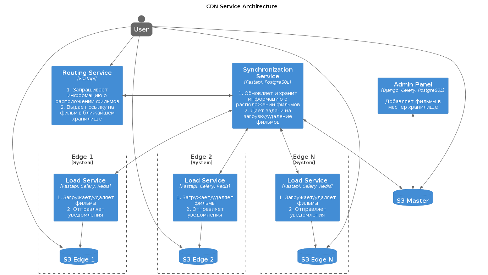
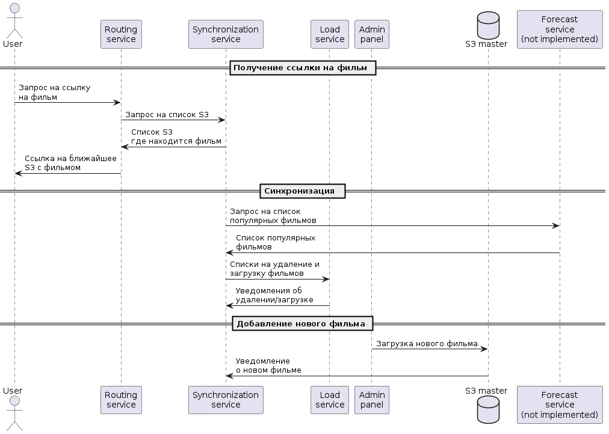

### Сервис CDN

MVP сервиса CDN для онлайн-кинотеатра.

Новый функционал находится в папке /cdn, а также частично в /movies_admin
(добавление файлов в S3 хранилище). Остальные сервисы (авторизация, бэкенд,
ugc, etl) взяты из предыдущих спринтов.

### Над проектом работали:  
* Михаил Лукин (Тимлид) https://github.com/Pummas
* Валерия Малышева https://github.com/valerycode
* Роман Боровский https://github.com/RomanBorovskiy
* Сергей Моричев https://github.com/s-morichev

### Запуск сервисов

Переименуйте env.example в .env, в папке /prometheus переименуйте .minio_jwt_example в
 .minio_jwt. Затем выполните `make dev-run`
После запуска контейнеров в web-ui minio (http://127.0.0.1:9001/login) подключите уведомления
put и delete к бакету movies.

### Некоторые открытые на хосте сервисы
- http://127.0.0.1/admin админка
- http://127.0.0.1/backend/openapi backend swagger
- http://127.0.0.1/media/openapi routing service swagger
- http://127.0.0.1:8012/openapi sync service swagger

### Архитектура

### Диграмма последовательности

